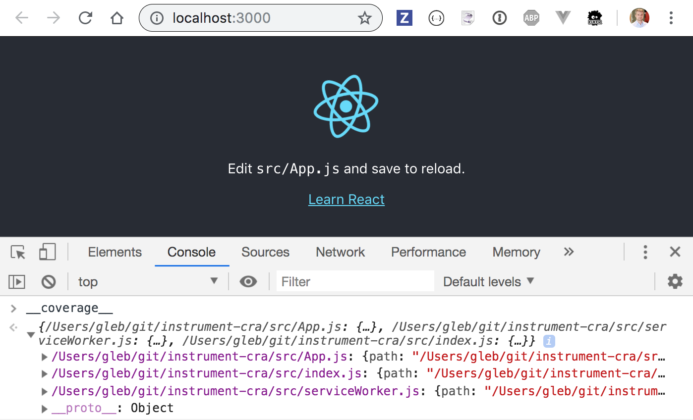

# @cypress/instrument-cra [![renovate-app badge][renovate-badge]][renovate-app] [](https://circleci.com/gh/cypress-io/instrument-cra/tree/master)
> Little module for CRA applications to instrument code without ejecting react-scripts

## Install and use

```
yarn add @cypress/instrument-cra
```

Then change your `npm start` script to require this module before starting the dev server

```json
{
  "scripts": {
    "start": "react-scripts -r @cypress/instrument-cra start",
  }
}
```

This module assumes standard [Create-React-App v3](https://github.com/facebook/create-react-app) JavaScript application with source files in the "src" folder.

When the app starts with `yarn start`, you should see the coverage information under `window.__coverage__` information.



The instrumentation is done using [Istanbul.js](https://istanbul.js.org/) via [babel-plugin-istanbul](https://github.com/istanbuljs/babel-plugin-istanbul) and is compatible with [@cypress/code-coverage](https://github.com/cypress-io/code-coverage) plugin.

## Exclude files

If you want to exclude files from coverage, for example `src/serviceWorker.js`, add an object named `nyc` to `package.json` following the [nyc CLI configuration](https://github.com/istanbuljs/nyc#configuring-nyc).

```json
{
  "nyc": {
    "exclude": "src/serviceWorker.js"
  }
}
```

## Instrument a fork

To instrument a [fork of `react-scripts`](https://create-react-app.dev/docs/alternatives-to-ejecting/), provide the path to the new `webpack.config.js` in your `package.json` as `cypressWebpackConfigPath`, e.g.:

```json
{
  "cypressWebpackConfigPath": "./node_modules/@my-org/my-react-scripts-fork/config/webpack.config.js"
}
```

## Force instrumentation

Usually, the code is only instrumented in the `development` environment. If you want to force the instrumentation, set the environment variable

```
CYPRESS_INSTRUMENT_PRODUCTION=true
```

## Debugging

Run with environment variable `DEBUG=instrument-cra` to see the verbose logs

## Notes

If you try to start the application, and `react-scripts` shows an error `There might be a problem with the project dependency tree.`, just create a local file `.env` with. The problem is due to several versions of `babel-loader` dependency between this plugin and your application.

```
SKIP_PREFLIGHT_CHECK=true
```

## Examples

### In this repository

- [react-scripts v3](examples/react-scripts-v3)
- [react-scripts v4](examples/react-scripts-v4)

### External

- [React JavaScript app](https://github.com/bahmutov/testing-react)
- [React TypeScript app](https://github.com/bahmutov/cra-ts-code-coverage-example)

## License

MIT License, see [LICENSE](LICENSE)

[renovate-badge]: https://img.shields.io/badge/renovate-app-blue.svg
[renovate-app]: https://renovateapp.com/
