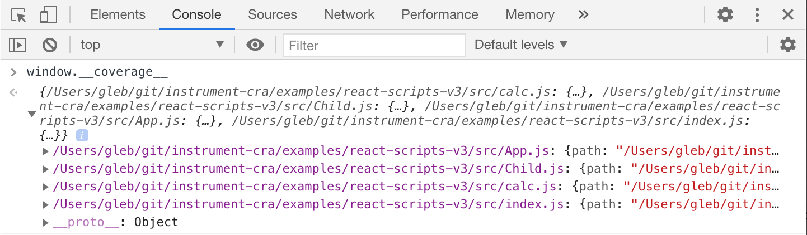

# example: react-scripts v3

> This example instruments the React application that is using react-scripts v3 to run

## use

First, install the dependencies in the root folder of this repository

Second, install dependencies here

```shell
npm install
```

Start the application

```shell
npm start
```

The application should be instrumented, which you can check in the browser at `localhost:3000` by looking at the object `window.__coverage__`.



Run Cypress tests

```shell
npm test
```

The output should be saved in reports in the `coverage` folder.

```shell
open coverage/lcov-report/index.html
```


## Notes

`react-scripts` after v3.4.0 have a bug, and stop the [dev server immediately](https://github.com/cypress-io/instrument-cra/pull/197#issuecomment-716763878). The [pull request](https://github.com/facebook/create-react-app/pull/8807) to fix it was ignored and closed. Thus we in the [package.json](package.json) file we set the version to 3.4.0 for now.
